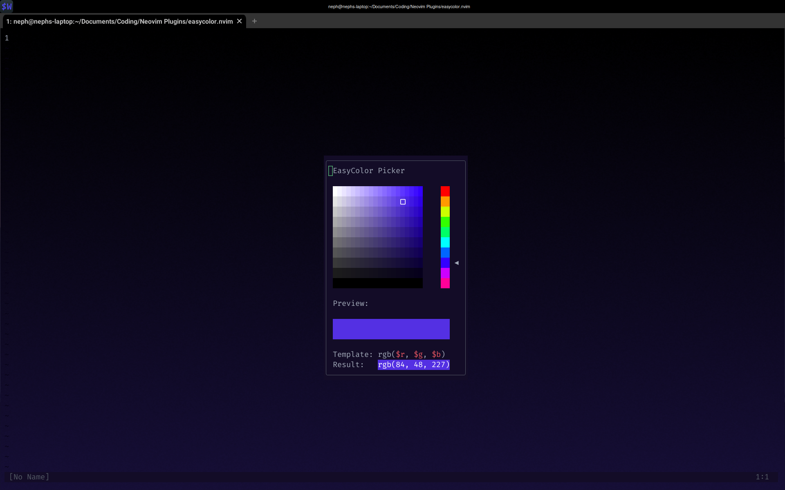

# easycolor.nvim

The easiest Neovim color picker in the world. `easycolor.nvim` brings the classic Photoshop-style color picker into Neovim.

## Demo



## Example Installation

Using `lazy.nvim`:
```lua
{
    "neph-iap/easycolor.nvim",
    dependencies = { "stevearc/dressing.nvim" } -- Optional, but provides better UI for editing the formatting template
    opts = {},
    keys = { { "<leader>b", "<cmd>EasyColor<cr>", desc = "Color Picker" } }
}
```

## Features

`easycolor.nvim` supports inserting colors as RGB, HSV, HSL, hex, and even combinations of them. Using the formatter, you can specify how colors should be inserted, such as `$h, $s, $v`, `$r $g $b`, `{ red: $r, green: $b, blue: $b }`, etc.

## Configuration Options
The following is the default configuration options for `easycolor.nvim`:
```lua
local default_config = {
	ui = {
		border = "rounded", -- Border style of the window
		symbols = {
			selection = "󰆢", -- The symbol to draw over the selected color
			hue_arrow = "◀" -- The arrow to draw next to the selected hue
		},
		mappings = {
			q = "close_window", -- The action when q is pressed, close window by default.
			j = "move_cursor_down", -- The action when j is pressed, move cursor down by default.
			k = "move_cursor_up", -- The action when k is pressed, move cursor up by default.
			h = "move_cursor_left", -- The action when h is pressed, move cursor left by default.
			l = "move_cursor_right", -- The action when l is pressed, move cursor right by default.
			["<Down>"] = "hue_down", -- The action when <Down> is pressed, hue down by default.
			["<Up>"] = "hue_up", -- The action when <Up> is pressed, hue up by default.
			["<Enter>"] = "insert_color", -- The action when <Enter> is pressed, insert color by default.
			t = "edit_formatting_template" -- The action when t is pressed, edit formatting template by default.
		}
	},
	formatting = {
		default_format = "$X"
	}
}
```

## Motivation

Neovim already has several color pickers available, but I found none of them to be very enjoyable to use. RGB sliders are a pain, and trying to think of the red green and blue components of a color can be challenging. Furthermore, HSV sliders are much better, but it can still be tricky to visualize how to get to the color in your head.

`easycolor.nvim` aims to bring the familiar color picker from applications like Photoshop, Gimp, paint.net, and more into Neovim. This 2D XY=SV + Hue Slider model has proven inuitive and simple to use, and is the standard for many applications.

`easycolor.nvim` does provide a more limited selection of colors than other plugins. This plugin is designed for those who don't need access to all 16.8 million colors, and instead prefer ease of use over fine-grained selection.

## Formatting Codes

Available formatting codes are:
- `$X` - Uppercase hexadecimal (i.e. #4A08AB)
- `$x` - Lowercase hexadecimal (i.e. #4a08ab)
- `$r` - Red, 0 - 255
- `$g` - Green, 0 - 255
- `$b` - Blue, 0 - 255
- `$h` - Hue, 0 - 360
- `$s` - Saturation, 0 - 1
- `$v` - Value, 0 - 1
